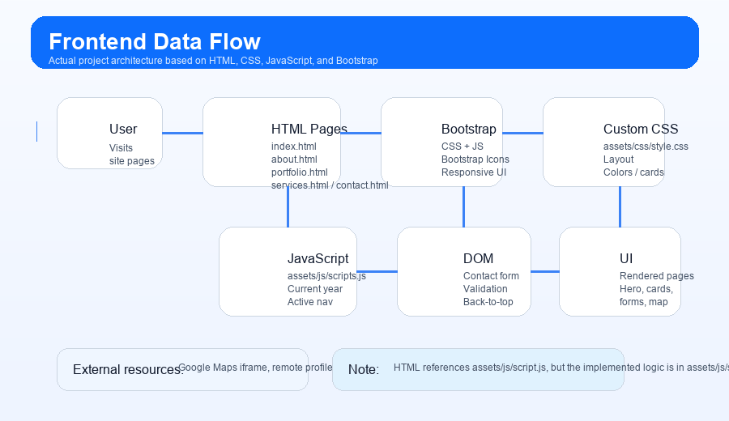
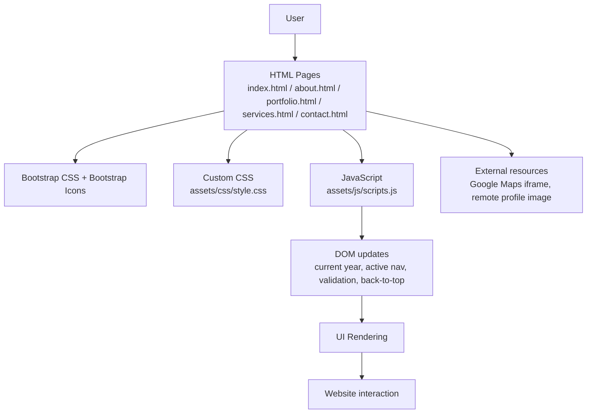

# Mehedi Portfolio

A professional multi-page personal portfolio website for Mehedi Alam, built using HTML5, CSS3, JavaScript, and Bootstrap 5. The project presents the developer's background, services, portfolio highlights, and a contact page with a browser-side demo form submission flow.

## Table of Contents

- [Project Overview](#project-overview)
- [Features](#features)
- [Technology Stack](#technology-stack)
- [Project Structure](#project-structure)
- [Pages and Sections](#pages-and-sections)
- [JavaScript Behavior](#javascript-behavior)
- [Usage](#usage)
- [Project Maintenance and Contact](#project-maintenance-and-contact)
- [License](#license)
- [Frontend Data Flow](#-frontend-data-flow)
- [Important Implementation Note](#important-implementation-note)

## Project Overview

This project is a static frontend portfolio website designed to represent Mehedi Alam as a Project Manager and Backend Developer. It is structured as a small multi-page website with shared navigation, reusable styling, and consistent branding across all pages.

The site is intended for:

- Potential clients evaluating services and availability
- Employers or collaborators reviewing skills and experience
- Visitors who want to contact the developer through a front-end demo contact form

The implemented pages include:

- Home
- About
- Portfolio
- Services
- Contact

The website focuses on a clean, modern, business-style UI with a strong emphasis on readability and professional presentation.

[Back to Contents](#table-of-contents)

## Features

The following features are actually implemented in the current workspace:

- Multi-page portfolio website with shared navigation and footer
- Bootstrap-based responsive layout across desktop and mobile screens
- Hero section on the home page with a profile image and call-to-action buttons
- About page with biography, client examples, skill progress bars, and badges
- Portfolio page with personal information, education, training, skills, and work experience sections
- Services page with six service cards and client category cards
- Contact page with direct contact details, social media links, an embedded map, and a contact form
- Browser-side form validation for the contact form using native HTML validation
- Success notification message after valid form submission
- Sticky top navigation and active page highlighting based on the current URL
- Back-to-top button that appears after scrolling
- Auto-generated footer year using JavaScript

[Back to Contents](#table-of-contents)

## Technology Stack

| Technology        | Purpose                                                                      |
| ----------------- | ---------------------------------------------------------------------------- |
| HTML5             | Page structure and content across all pages                                  |
| CSS3              | Custom styling, layout, colors, spacing, responsiveness, and card effects    |
| JavaScript        | DOM updates, form validation, scroll handling, and navigation highlighting   |
| Bootstrap 5       | Responsive grid system, navigation, forms, buttons, and shared UI components |
| Bootstrap Icons   | Iconography used throughout the project                                      |
| Google Maps Embed | Embedded map on the contact page                                             |

### External asset notes

- Bootstrap CSS and JS are loaded from the Bootstrap CDN.
- Bootstrap Icons are loaded from the Bootstrap Icons CDN.
- A remote profile image is used on the home page.
- No package manager configuration, build pipeline, or framework setup was found in this workspace.

[Back to Contents](#table-of-contents)

## Project Structure

```text
WDDF-Personal-Portfolio/
├── about.html
├── contact.html
├── index.html
├── portfolio.html
├── services.html
├── README.md
├── LICENSE
├── assets/
│   ├── css/
│   │   └── style.css
│   └── js/
│       └── scripts.js
├── docs/
│   ├── data-flow.gif
│   └── data-flow.svg
└── .git/
```

### Important file roles

- `index.html`: Home page
- `about.html`: Biography, skills, and client summary
- `portfolio.html`: Education, work history, and profile info
- `services.html`: Services offered and client categories
- `contact.html`: Direct contact section, contact form, and map embed
- `assets/css/style.css`: Main custom styling for the portfolio site
- `assets/js/scripts.js`: JavaScript for year rendering, active nav highlighting, validation, and scroll behavior
- `docs/data-flow.svg`: Scalable data-flow diagram
- `docs/data-flow.gif`: Animated data-flow diagram

[Back to Contents](#table-of-contents)

## Pages and Sections

### 1. Home Page (`index.html`)

The home page is the landing page for the portfolio. It contains:

- A sticky navigation bar with links to all main pages
- A hero section introducing Mehedi Alam
- A mission and vision section
- A service preview block
- A client feedback/testimonials section
- A branded footer
- A fixed back-to-top button

### 2. About Page (`about.html`)

The about page focuses on the personal profile and technical background. It includes:

- A page header
- A personal biography section
- Existing client examples
- Skill information with progress bars
- Skill badges for technologies and professional strengths

### 3. Portfolio Page (`portfolio.html`)

The portfolio page delivers a more formal profile overview, including:

- Personal information
- Education background
- Special skills cards
- Training information
- Working experience timeline

### 4. Services Page (`services.html`)

The services page presents the professional offerings. The implemented sections include:

- Website Development
- Django Development
- Project Management
- Data Analysis
- API Integration
- Technical Training

Each service is presented in a card layout with supporting bullet points.

### 5. Contact Page (`contact.html`)

The contact page includes:

- Direct contact details such as email, phone, and location
- Social media buttons for GitHub, LinkedIn, and Facebook
- A contact form with required field validation
- A success alert after valid submission
- An embedded map showing Dhaka, Bangladesh

[Back to Contents](#table-of-contents)

## JavaScript Behavior

The JavaScript implementation is contained in `assets/js/scripts.js` and performs the following actual behaviors:

```javascript
// Automatically set the current year in all footer elements.
document.querySelectorAll(".current-year").forEach(function (element) {
  element.textContent = new Date().getFullYear();
});
```

```javascript
// Highlight the current navigation page.
const currentPage = window.location.pathname.split("/").pop() || "index.html";
document.querySelectorAll(".navbar .nav-link").forEach(function (link) {
  const linkPage = link.getAttribute("href");
  if (linkPage === currentPage) {
    link.classList.add("active");
  }
});
```

```javascript
// Contact form validation and demo submission.
form.addEventListener("submit", function (event) {
  event.preventDefault();

  if (!form.checkValidity()) {
    event.stopPropagation();
    form.classList.add("was-validated");
    return;
  }

  message.classList.remove("d-none");
  form.reset();
  form.classList.remove("was-validated");
});
```

```javascript
// Back-to-top button behavior.
window.addEventListener("scroll", function () {
  backToTop.style.display = window.scrollY > 400 ? "inline-flex" : "none";
});

backToTop.addEventListener("click", function () {
  window.scrollTo({ top: 0, behavior: "smooth" });
});
```

### Interactive behaviors observed from the code

- Footer year updates automatically
- Active navigation item is highlighted according to the current page
- Contact form shows validation feedback and a success message for a valid submission
- Back-to-top button appears after page scroll and scrolls the page upward smoothly

[Back to Contents](#table-of-contents)

## Page-by-Page Setup, Running, and Usage Guide

This project is a static frontend portfolio website, so there is no build step, package installation step, or framework compilation step. The project is run by opening the HTML files directly in a browser or by serving the folder through a simple local web server.

### 1. Prerequisites and project setup

Before you begin, make sure you have the following available on your machine:

- A modern web browser such as Chrome, Edge, or Firefox
- VS Code (recommended for editing and previewing)
- Python 3.x (optional but useful for a local web server)
- Git (optional, for version control)

#### Open the project in VS Code

```bash
cd "c:\Users\mehed\OneDrive\Desktop\Github\WDDF-Personal-Portfolio"
```

Then open the folder in VS Code.

#### Recommended folder structure understanding

```text
WDDF-Personal-Portfolio/
├── index.html
├── about.html
├── portfolio.html
├── services.html
├── contact.html
├── assets/
│   ├── css/style.css
│   └── js/scripts.js
├── README.md
├── LICENSE
└── docs/
    ├── data-flow.svg
    └── data-flow.gif
```

> This project uses shared assets across pages, so the CSS and JavaScript files are reused by every page.

#### Start a local server (recommended)

Because the site is static, a local web server is the cleanest way to view it and test navigation between pages.

```bash
cd "c:\Users\mehed\OneDrive\Desktop\Github\WDDF-Personal-Portfolio"
python -m http.server 8000
```

Then open:

```text
http://localhost:8000
```

You can also use a VS Code extension such as Live Server if you prefer a browser preview inside the editor.

[Back to Contents](#table-of-contents)

### 2. Home page setup and usage (`index.html`)

The home page is the project landing page and introduces Mehedi Alam with a hero section, mission and vision, service previews, testimonial cards, and a footer.

#### What this page contains

- Sticky top navigation
- Hero section with profile image
- Mission and Vision blocks
- Services preview cards
- Client feedback/testimonial cards
- Footer with contact information
- Back-to-top button

#### How to view the home page

Option A: open the file directly in a browser.

```text
index.html
```

Option B: run the local server and open the root.

```text
http://localhost:8000/
```

#### What to check on this page

```text
1. Navbar links should navigate to all other pages.
2. The hero section should display correctly on desktop and mobile.
3. The back-to-top button should appear after scrolling down.
4. The footer year should update automatically.
```

[Back to Contents](#table-of-contents)

### 3. About page setup and usage (`about.html`)

The About page is a profile and skills page. It shows the biography, professional summary, existing client examples, and skill progress bars.

#### What this page contains

- Page header for About Me
- Personal biography section
- Client/project examples
- Skill information with progress bars
- Technology badges and strengths

#### How to view the page

```text
http://localhost:8000/about.html
```

or

```text
about.html
```

#### What to check on this page

```text
1. The page should load the same shared navbar and footer.
2. Progress bars should render as styled horizontal bars.
3. The content should remain readable on smaller devices.
4. The page should match the portfolio branding used throughout the project.
```

[Back to Contents](#table-of-contents)

### 4. Portfolio page setup and usage (`portfolio.html`)

The Portfolio page presents the developer's profile in a more formal professional format. It contains personal information, education, skill highlights, training, and work experience.

#### What this page contains

- Personal information block
- Education timeline
- Special skills cards
- Training information sections
- Working experience timeline

#### How to view the page

```text
http://localhost:8000/portfolio.html
```

or

```text
portfolio.html
```

#### What to check on this page

```text
1. The page should show the complete timeline and card sections.
2. The layout should adapt smoothly across screen sizes.
3. All info blocks should align with the same styling system used across the project.
```

[Back to Contents](#table-of-contents)

### 5. Services page setup and usage (`services.html`)

The Services page lists the professional offerings in a card-based layout. This is the page that showcases the services the developer says they provide.

#### What this page contains

- Website Development
- Django Development
- Project Management
- Data Analysis
- API Integration
- Technical Training
- Client categories section

#### How to view the page

```text
http://localhost:8000/services.html
```

or

```text
services.html
```

#### What to check on this page

```text
1. The service cards should load with consistent spacing and icon styling.
2. The client category cards should appear beneath the main service section.
3. Page should remain visually balanced on mobile and tablet screens.
```

[Back to Contents](#table-of-contents)

### 6. Contact page setup and usage (`contact.html`)

The Contact page includes direct communication details, social media links, a contact form, and an embedded Google Map.

#### What this page contains

- Direct contact information
- Social media buttons
- Contact form with required fields
- Validation feedback messages
- Successful submission success message
- Embedded map section

#### How to view the page

```text
http://localhost:8000/contact.html
```

or

```text
contact.html
```

#### What to check on this page

```text
1. The form should validate required fields before submission.
2. A valid form submission should show the success alert.
3. The social buttons should display icons and open the correct destinations.
4. The iframe map should load and display Dhaka, Bangladesh.
```

#### Contact form test flow

```text
1. Open the Contact page.
2. Click the Send Message button without filling the form.
3. Verify that validation messages appear.
4. Fill all required fields.
5. Submit the form.
6. Verify that the success alert appears and the form resets.
```

#### Contact form test in browser

```javascript
// Example browser-side test flow
// 1. Open contact.html
// 2. Submit empty form -> validation should appear
// 3. Enter valid data -> message should show
// 4. Form should reset after successful submission
```

[Back to Contents](#table-of-contents)

### 7. Shared tools and setup details

This project relies on a small set of shared frontend tools and resources.

#### A. VS Code

VS Code is the recommended editor for this project because it makes it easy to navigate HTML, CSS, and JavaScript files and preview the site.

Typical workflow:

```bash
cd "c:\Users\mehed\OneDrive\Desktop\Github\WDDF-Personal-Portfolio"
code .
```

#### B. Browser

Use a modern browser to visualize the layout and test user interactions.

Recommended browser actions:

```text
- Open any page directly
- Resize the browser to test responsiveness
- Open Developer Tools to inspect HTML, CSS, and JS behavior
```

#### C. Python local web server

This project does not need npm or a package install. A simple static server is enough.

```bash
cd "c:\Users\mehed\OneDrive\Desktop\Github\WDDF-Personal-Portfolio"
python -m http.server 8000
```

Then browse to:

```text
http://localhost:8000
```

#### D. Git

You can use Git for tracking changes and pushing updates to the repository.

```bash
git status
git add .
git commit -m "Update portfolio README and docs"
git push origin main
```

#### E. Bootstrap and CDN resources

This project uses Bootstrap and Bootstrap Icons from CDN URLs, so no local installation is required.

```html
<link
  href="https://cdn.jsdelivr.net/npm/bootstrap@5.3.3/dist/css/bootstrap.min.css"
  rel="stylesheet"
/>
<link
  href="https://cdn.jsdelivr.net/npm/bootstrap-icons@1.11.3/font/bootstrap-icons.min.css"
  rel="stylesheet"
/>
<script src="https://cdn.jsdelivr.net/npm/bootstrap@5.3.3/dist/js/bootstrap.bundle.min.js"></script>
```

#### F. Project JavaScript tooling

The site uses plain JavaScript, not a frontend framework or build system.

Special logic in the project includes:

```javascript
// Update current year in footer
const yearNodes = document.querySelectorAll(".current-year");

// Highlight active nav item based on current page
const currentPage = window.location.pathname.split("/").pop() || "index.html";

// Validate contact form
if (!form.checkValidity()) {
  form.classList.add("was-validated");
}
```

[Back to Contents](#table-of-contents)

### 8. Recommended sequential workflow for this project

Use the following order when working in the project:

```text
1. Open the project folder in VS Code.
2. Inspect the shared CSS file: assets/css/style.css
3. Inspect the shared JavaScript file: assets/js/scripts.js
4. Review index.html for the landing page layout.
5. Review about.html, portfolio.html, services.html, and contact.html one by one.
6. Run a local web server.
7. Open the local site in the browser.
8. Test navigation, responsiveness, and form validation.
9. Update content or styling only after verifying the page behavior.
```

#### Example sequential setup commands

```bash
cd "c:\Users\mehed\OneDrive\Desktop\Github\WDDF-Personal-Portfolio"
python -m http.server 8000
```

Then open:

```text
http://localhost:8000/index.html
http://localhost:8000/about.html
http://localhost:8000/portfolio.html
http://localhost:8000/services.html
http://localhost:8000/contact.html
```

[Back to Contents](#table-of-contents)

## Usage

### Option 1: Open directly in a browser

You can open any HTML file directly in a browser, such as:

```bash
index.html
```

### Option 2: Run a local web server

Because this is a static site, you can also run a simple local server from the project root:

```bash
cd "c:\Users\mehed\OneDrive\Desktop\Github\WDDF-Personal-Portfolio"
python -m http.server 8000
```

Then open:

```text
http://localhost:8000
```

### Recommended page flow

1. Start with `index.html` to view the landing page.
2. Navigate to `about.html` for the biography and skills.
3. Review `portfolio.html` for education, training, and experience.
4. Open `services.html` for service offerings.
5. Use `contact.html` to try the form and view the map embed.

[Back to Contents](#table-of-contents)

## Project Maintenance and Contact

### Project Maintainer

- Name: Mehedi Alam
- Email: mehedialam806@gmail.com
- GitHub: https://github.com/MehediAlam49
- LinkedIn: https://www.linkedin.com/in/dev-mehedialam/
- Facebook: https://www.facebook.com/MehediAlam49/
- Repository: https://github.com/MehediAlam49/WDDF-Personal-Portfolio

### Contact page details in the project

The current contact page shows:

- Email: `mehedialam806@gmail.com`
- Phone: `+880 1772 050842`
- Location: Dhaka, Bangladesh
- Social links for GitHub, LinkedIn, and Facebook

[Back to Contents](#table-of-contents)

## License

This project is licensed under the MIT License.

```text
MIT License

Copyright (c) 2026 Mehedi Alam

Permission is hereby granted, free of charge, to any person obtaining a copy
of this software and associated documentation files (the "Software"), to deal
in the Software without restriction, including without limitation the rights
to use, copy, modify, merge, publish, distribute, sublicense, and/or sell
copies of the Software, and to permit persons to whom the Software is
furnished to do so, subject to the following conditions:

The above copyright notice and this permission notice shall be included in all
copies or substantial portions of the Software.

THE SOFTWARE IS PROVIDED "AS IS", WITHOUT WARRANTY OF ANY KIND, EXPRESS OR
IMPLIED, INCLUDING BUT NOT LIMITED TO THE WARRANTIES OF MERCHANTABILITY,
FITNESS FOR A PARTICULAR PURPOSE AND NONINFRINGEMENT. IN NO EVENT SHALL THE
AUTHORS OR COPYRIGHT HOLDERS BE LIABLE FOR ANY CLAIM, DAMAGES OR OTHER
LIABILITY, WHETHER IN AN ACTION OF CONTRACT, TORT OR OTHERWISE, ARISING FROM,
OUT OF OR IN CONNECTION WITH THE SOFTWARE OR THE USE OR OTHER DEALINGS IN THE
SOFTWARE.
```

[Back to Contents](#table-of-contents)

## 🔄 Frontend Data Flow

<p align="center">
  
</p>

The actual frontend flow in this project is straightforward and static. The user starts on one of the HTML pages (`index.html`, `about.html`, `portfolio.html`, `services.html`, or `contact.html`). Those pages are styled by the shared `assets/css/style.css` file and Bootstrap CSS, then enhanced by `assets/js/scripts.js`.

The JavaScript file updates the footer year, highlights the active navigation link, validates the contact form, and controls the back-to-top button. On the contact page, the contact form performs browser-side validation only and shows a success message without sending data anywhere. The embedded map uses a Google Maps iframe, while the hero image is loaded from a remote URL.

### Static Mermaid version



[Back to Contents](#table-of-contents)

## Important Implementation Note

The workspace currently contains `assets/js/scripts.js`, while the HTML files reference `assets/js/script.js`. Based on the project files present in this workspace, the front-end interactive logic is actually implemented in `assets/js/scripts.js`, which is the file that contains the form validation, year update, active navigation highlighting, and back-to-top behavior.

This README documents the implementation that is present in the current workspace and does not alter the original project source files.

[Back to Contents](#table-of-contents)
